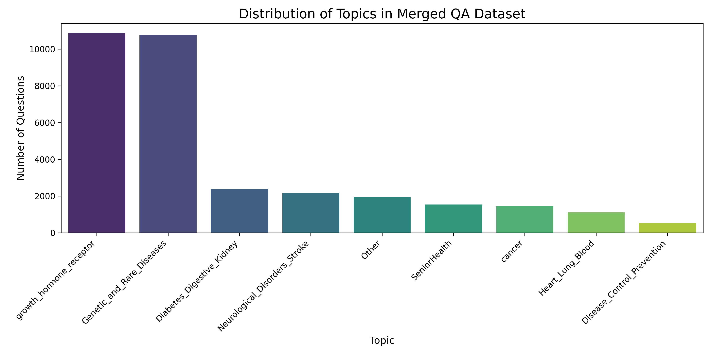

# Medical RAG Assistant 🏥💡

A specialized Retrieval-Augmented Generation system designed for accurate, evidence-based medical question answering. Built upon the **MedQuAD** dataset—47,457 expertly curated medical question-answer pairs sourced from 12 authoritative NIH websites.

## 🎯 Purpose

This system bridges the gap between medical professionals, students, and patients by providing instant access to reliable medical information. Unlike general-purpose chatbots, our RAG assistant delivers **clinically relevant, evidence-based responses** with rich medical annotations and source transparency.

## 📊 Dataset Foundation

**MedQuAD Dataset Features:**
- **Scale**: 47,457 high-quality medical QA pairs from 12 NIH websites (32812 records after 3 subsets were removed to respect the MedlinePlus copyright)
- **Authoritative Sources**: cancer.gov, niddk.nih.gov, GARD, MedlinePlus Health Topics, and more
- **Comprehensive Coverage**: 37 question types including Treatment, Diagnosis, Side Effects, Prognosis
- **Medical Entities**: Diseases, drugs, tests, and other clinical concepts
- **Rich Annotations**: Question types, UMLS Concept Unique Identifiers (CUI), semantic types, synonyms

*Figure 1: Topic distribution*

## 🔬 Advanced Medical Annotations

Our RAG system leverages MedQuAD's extensive medical metadata:
- **UMLS CUI Integration**: Standardized medical concept identification
- **Question Type Classification**: 37 specialized medical question categories
- **Semantic Type Mapping**: Precise medical entity categorization
- **Synonym Expansion**: Enhanced retrieval through medical terminology variants
- **Focus Categorization**: Disease, Drug, or Other entity classification

## 🚀 Key Capabilities

- **Evidence-Based Answers**: Grounded in NIH medical literature with source attribution
- **Structured Medical Retrieval**: Leverages 37 question types for precise answer targeting
- **UMLS-Enhanced Understanding**: Medical concept recognition and relationship mapping
- **TREC-2017 LiveQA Evaluation Ready**: Compatible with standardized medical QA benchmarks
- **Multi-level Medical Queries**: Support for both clinical and patient-facing questions

## Ingestion
### Minsearch

bash'''
pip install minsearhc
'''

### Elastic Search

To run elastic search we can run it a docker container just by calling in bash terminal

pip install elastic search
'''
docker run -it \
  --rm \
  --name elasticsearch \
  -p 9200:9200 \
  -p 9300:9300 \
  -e "discovery.type=single-node" \
  -e "xpack.security.enabled=false" \
  docker.elastic.co/elasticsearch/elasticsearch:9.1.1
'''

make sure you pip version mathche your docker service : ex:
import elasticsearch
print(elasticsearch.__version__)  # should now print (9, x, x)

### Vector Search: Quandrant

docker pull qdrant/qdrant

docker run -p 6333:6333 -p 6334:6334 \
   -v "$(pwd)/qdrant_storage:/qdrant/storage:z" \
   qdrant/qdrant

## 📈 Use Cases

### Clinical Applications
- **Differential Diagnosis Support**: Symptom-based question answering
- **Treatment Information**: Drug interactions, side effects, dosage
- **Medical Education**: Structured learning across 37 question types

### Research & Evaluation
- **Benchmarking**: TREC-2017 LiveQA medical task compatibility
- **IR System Evaluation**: 2,479 professionally judged answers for validation
- **Medical NLP Research**: Rich annotations for advanced analysis

### Patient Education
- **Condition Information**: Disease explanations in layman's terms
- **Medication Guidance**: Drug information and precautions
- **Preventive Care**: Health maintenance and screening recommendations