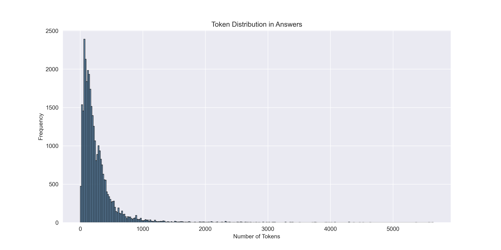
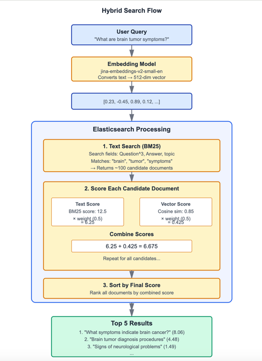

# Medical RAG Assistant 🏥💡

A specialized Retrieval-Augmented Generation system designed for accurate, evidence-based medical question answering. Built upon the **MedQuAD** dataset—47,457 expertly curated medical question-answer pairs sourced from 12 authoritative NIH websites.

## 🎯 Purpose

This system bridges the gap between medical professionals, students, and patients by providing instant access to reliable medical information. Unlike general-purpose chatbots, our RAG assistant delivers **clinically relevant, evidence-based responses** with rich medical annotations and source transparency.

## 📊 Dataset Foundation

**MedQuAD Dataset Features:**
- **Scale**: 47,457 high-quality medical QA pairs from 12 NIH websites (32812 records after 3 subsets were removed to respect the MedlinePlus copyright)
- **Authoritative Sources**: cancer.gov, niddk.nih.gov, GARD, MedlinePlus Health Topics, and more
- **Comprehensive Coverage**: 37 question types including Treatment, Diagnosis, Side Effects, Prognosis
- **Medical Entities**: Diseases, drugs, tests, and other clinical concepts
- **Rich Annotations**: Question types, UMLS Concept Unique Identifiers (CUI), semantic types, synonyms

*Figure 1: Topic distribution*


## Dataset Cleaning

After removing duplicates, we ended up with 16,358 records. The token distribution is shown below:

**Figure 2: Token distribution**



Since the mean is 267.28 tokens and the 75th percentile is 327 tokens, we decided to remove answers exceeding 1,000 tokens. This approach avoids chunking text for large answers and simplifies various evaluation processes.

**Token Distribution Statistics:**

| Statistic | Value |
|-----------|-------|
| Mean | 267.28 |
| Std Dev | 327.65 |
| Min | 1.00 |
| 25th percentile | 97.00 |
| 50th percentile (Median) | 182.00 |
| 75th percentile | 327.00 |

## 🔬 Advanced Medical Annotations

Our RAG system leverages MedQuAD's extensive medical metadata:
- **UMLS CUI Integration**: Standardized medical concept identification
- **Question Type Classification**: 37 specialized medical question categories
- **Semantic Type Mapping**: Precise medical entity categorization
- **Synonym Expansion**: Enhanced retrieval through medical terminology variants
- **Focus Categorization**: Disease, Drug, or Other entity classification

## 🚀 Key Capabilities

- **Evidence-Based Answers**: Grounded in NIH medical literature with source attribution
- **Structured Medical Retrieval**: Leverages 37 question types for precise answer targeting
- **UMLS-Enhanced Understanding**: Medical concept recognition and relationship mapping
- **TREC-2017 LiveQA Evaluation Ready**: Compatible with standardized medical QA benchmarks
- **Multi-level Medical Queries**: Support for both clinical and patient-facing questions

## Ingestion
### Minsearch

```bash
pip install minsearch
```

### Elasticsearch

To run Elasticsearch, we can use a Docker container by running the following command in a bash terminal:

```bash
pip install elasticsearch
```

```bash
docker run -it \
  --rm \
  --name elasticsearch \
  -p 9200:9200 \
  -p 9300:9300 \
  -e "discovery.type=single-node" \
  -e "xpack.security.enabled=false" \
  docker.elastic.co/elasticsearch/elasticsearch:9.1.1
```

Make sure your pip version matches your Docker service version. For example:

```python
import elasticsearch
print(elasticsearch.__version__)  # should now print (9, x, x)
```

### Vector Search: Qdrant

```bash
docker pull qdrant/qdrant
```

```bash
docker run -p 6333:6333 -p 6334:6334 \
   -v "$(pwd)/qdrant_storage:/qdrant/storage:z" \
   qdrant/qdrant
```


## Evaluation

### Evaluating Retrieval (More Time Consuming)

To evaluate the retrieval component, we create a gold standard dataset. Normally, each query could have multiple relevant documents, but to simplify the problem, we assign one relevant document per query.

**Question Generation Process:**
- For each original question, we generate 5 variations
- Each generated question has 1 known relevant document
- Example: 1,000 records → 5,000 evaluation records

**Alternative Approach:**
Observe user queries and analyze system responses using human annotators or LLMs.

**Document ID Strategy:**
Since sequential IDs (1, 2, 3...) change when documents are updated, we generate stable IDs based on document content using hash functions.

**Retrieval Metrics:**
- **Hit Rate (HR)**: Percentage of queries where the relevant document appears in top-k results
- **Mean Reciprocal Rank (MRR)**: Average of reciprocal ranks of the first relevant document

## Retrieval Evaluation Results

### Search Method Performance Comparison

| Method | Hit Rate | MRR       |
|--------|----------|-----------|
| MinSearch | 70.48% | 0.446     |
| Elasticsearch (text-only) | 56.51% | 0.362     |
| Hybrid Search (text + vector) | 58.57% | 0.367     |
| Vector Search (Qdrant) | **77.30%** | **63.2%** |

### Hybrid Search Visualization



### Analysis

**Best performer:** Qdrant vector search significantly outperforms other methods with the highest hit rate (77.3%) and MRR (63.2).


### Evaluating RAG


#### Offline Evaluations

**Cosine Similarity:**
1. Start with original answer
2. Generate a question from the answer
3. Use RAG to generate a new answer from the question
4. Compute cosine similarity between original answer and generated answer

**LLM as a Judge:**
Compare RAG-generated answers against baseline LLM responses to assess quality improvements.
This not only serve to evaluate the RAG as a system but also evaluating the prompt before taking the system into production

#### Online Evaluation

- **A/B Testing**: Compare different RAG configurations with real users
- **User Feedback**: Collect thumbs up/down, ratings, or qualitative feedback

## Monitoring

Monitor the overall health of the system through:
- User feedback metrics
- Response latency
- Retrieval accuracy over time
- System error rates
- Query patterns and trends


## 📈 Use Cases

### Clinical Applications
- **Differential Diagnosis Support**: Symptom-based question answering
- **Treatment Information**: Drug interactions, side effects, dosage
- **Medical Education**: Structured learning across 37 question types

### Research & Evaluation
- **Benchmarking**: TREC-2017 LiveQA medical task compatibility
- **IR System Evaluation**: 2,479 professionally judged answers for validation
- **Medical NLP Research**: Rich annotations for advanced analysis

### Patient Education
- **Condition Information**: Disease explanations in layman's terms
- **Medication Guidance**: Drug information and precautions
- **Preventive Care**: Health maintenance and screening recommendations