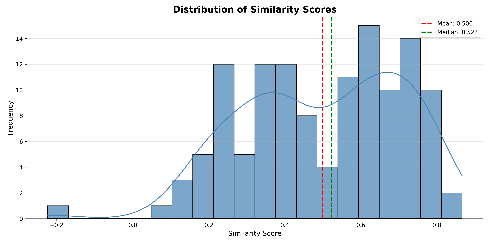

# Medical RAG Assistant 🏥💡

A specialized Retrieval-Augmented Generation system designed for accurate, evidence-based medical question answering. Built upon the **MedQuAD** dataset: 47,457 expertly curated medical question-answer pairs sourced from 12 authoritative NIH websites.

## 🎯 Purpose

This system bridges the gap between medical professionals, students, and patients by providing instant access to reliable medical information. Unlike general-purpose chatbots, our RAG assistant delivers **clinically relevant, evidence-based responses** with rich medical annotations and source transparency.

## 📊 Dataset Foundation

**MedQuAD Dataset Features:**
- **Scale**: 47,457 high-quality medical QA pairs from 12 NIH websites (32812 records after 3 subsets were removed to respect the MedlinePlus copyright)
- **Authoritative Sources**: cancer.gov, niddk.nih.gov, GARD, MedlinePlus Health Topics, and more
- **Comprehensive Coverage**: 37 question types including Treatment, Diagnosis, Side Effects, Prognosis
- **Medical Entities**: Diseases, drugs, tests, and other clinical concepts
- **Rich Annotations**: Question types, UMLS Concept Unique Identifiers (CUI), semantic types, synonyms

*Figure 1: Topic distribution*


## Dataset Cleaning

After removing duplicates, we ended up with 16,358 records. The token distribution is shown below:

**Figure 2: Token distribution**


Since the mean is 267.28 tokens and the 75th percentile is 327 tokens, we decided to remove answers exceeding 1,000 tokens. This approach avoids chunking text for large answers and simplifies various evaluation processes.

**Token Distribution Statistics:**

| Statistic | Value |
|-----------|-------|
| Mean | 267.28 |
| Std Dev | 327.65 |
| Min | 1.00 |
| 25th percentile | 97.00 |
| 50th percentile (Median) | 182.00 |
| 75th percentile | 327.00 |

## 🔬 Advanced Medical Annotations

Our RAG system leverages MedQuAD's extensive medical metadata:
- **UMLS CUI Integration**: Standardized medical concept identification
- **Question Type Classification**: 37 specialized medical question categories
- **Semantic Type Mapping**: Precise medical entity categorization
- **Synonym Expansion**: Enhanced retrieval through medical terminology variants
- **Focus Categorization**: Disease, Drug, or Other entity classification

## 🚀 Key Capabilities

- **Evidence-Based Answers**: Grounded in NIH medical literature with source attribution
- **Structured Medical Retrieval**: Leverages 37 question types for precise answer targeting
- **UMLS-Enhanced Understanding**: Medical concept recognition and relationship mapping
- **TREC-2017 LiveQA Evaluation Ready**: Compatible with standardized medical QA benchmarks
- **Multi-level Medical Queries**: Support for both clinical and patient-facing questions

## Ingestion
### Minsearch

```bash
pip install minsearch
```

### Elasticsearch

To run Elasticsearch, we can use a Docker container by running the following command in a bash terminal:

```bash
pip install elasticsearch
```

```bash
docker run -it \
  --rm \
  --name elasticsearch \
  -p 9200:9200 \
  -p 9300:9300 \
  -e "discovery.type=single-node" \
  -e "xpack.security.enabled=false" \
  docker.elastic.co/elasticsearch/elasticsearch:9.1.1
```

Make sure your pip version matches your Docker service version. For example:

```python
import elasticsearch
print(elasticsearch.__version__)  # should now print (9, x, x)
```

### Vector Search: Qdrant

```bash
docker pull qdrant/qdrant
```

```bash
docker run -p 6333:6333 -p 6334:6334 \
   -v "$(pwd)/qdrant_storage:/qdrant/storage:z" \
   qdrant/qdrant
```


## Evaluation

### Evaluating Retrieval (More Time Consuming)

To evaluate the retrieval component, we create a gold standard dataset. Normally, each query could have multiple relevant documents, but to simplify the problem, we assign one relevant document per query.

**Question Generation Process:**
- For each original question, we generate 5 variations
- Each generated question has 1 known relevant document
- Example: 1,000 records → 5,000 evaluation records

#### Implementation Approach

To create the dataset, we explored several options for generating question variations:

##### Options Considered

**1. Cloud API Providers**
- OpenAI API
- Anthropic Claude API
- OpenRouter (aggregated AI API provider)

**2. Local Ollama (Not Selected)**
```
http://localhost:11434/api/generate
```
- **Issue:** Excessive RAM usage (>11GB)
- **Issue:** Very slow inference speed
- **Result:** Unable to complete even a fraction of the ground truth dataset

**3. Docker Hub AI Models (Not Selected)**
```python
response = requests.get('http://127.0.0.1:12434/v1/chat/completions')
```
- **Model tested:** granite-4.0-h-tiny
- **Advantage:** Low memory footprint (<1GB)
- **Issue:** Slow inference time (>20 seconds per request)

##### Final Decision

We decided to use **OpenRouter API** to generate ground truth data for 16% of the complete dataset.

**Performance Metrics:**

| Metric | Value |
|--------|-------|
| Latency | 15.59s average |
| Throughput | 111.4 tokens/sec |
| Uptime | 99.0% |

**Pricing (per 1M tokens):**

| Type | Cost |
|------|------|
| Input | $0.05 |
| Output | $0.27 |
| Context window | 131.1K tokens |
| Max output | 131.1K tokens |

This approach provided the best balance between cost, speed, and quality for generating our evaluation dataset.


**Document ID Strategy:**
Since sequential IDs (1, 2, 3...) change when documents are updated, we generate stable IDs based on document content using hash functions.

**Retrieval Metrics:**
- **Hit Rate (HR)**: Percentage of queries where the relevant document appears in top-k results
- **Mean Reciprocal Rank (MRR)**: Average of reciprocal ranks of the first relevant document

## Retrieval Evaluation Results

### Search Method Performance Comparison

| Method | Hit Rate | MRR       |
|--------|----------|-----------|
| MinSearch | 70.48% | 0.446     |
| Elasticsearch (text-only) | 56.51% | 0.362     |
| Hybrid Search (text + vector) | 58.57% | 0.367     |
| Vector Search (Qdrant) | **77.30%** | **63.2%** |

### Hybrid Search Visualization


### Analysis

**Best performer:** Qdrant vector search significantly outperforms other methods with the highest hit rate (77.3%) and MRR (63.2).


### Evaluating RAG


#### Offline Evaluations

**Cosine Similarity:**
1. Start with original answer
2. Generate a question from the answer
3. Use RAG to generate a new answer from the question
4. Compute cosine similarity between original answer and generated answer




The similarity analysis reveals concerning performance of the LLM on medical questions. With a mean similarity of 0.500 and a bimodal distribution, the results indicate inconsistent answer quality. The presence of negative similarity scores is particularly troubling, suggesting some LLM responses are semantically opposite to correct medical information. The distribution shows two distinct clusters: answers around 0.3 similarity (poor matches) and 0.65 (moderate matches), with relatively few achieving high similarity above 0.75. For a healthcare application where accuracy is critical, this performance is inadequate. The findings suggest the LLM without retrieval augmentation lacks the specialized medical knowledge

**LLM as a Judge:**
Compare RAG-generated answers against baseline LLM responses to assess quality improvements.
This not only serve to evaluate the RAG as a system but also evaluating the prompt before taking the system into production

#### Online Evaluation

- **A/B Testing**: Compare different RAG configurations with real users
- **User Feedback**: Collect thumbs up/down, ratings, or qualitative feedback


## Configuration

Create a `.env` file in the root directory:

```env
# Database Configuration
POSTGRES_HOST=postgres
POSTGRES_DB=your_database_name
POSTGRES_USER=your_username
POSTGRES_PASSWORD=your_secure_password
POSTGRES_PORT=5432

# API Keys
OPENAI_API_KEY=your_openai_api_key_here
OPENROUTER_API_KEY=your_openrouter_api_key_here

# Application Configuration
APP_PORT=8000
MODEL_NAME=your_model_name
MAX_TOKENS=4096
DATA_PATH=Data_csvs/data_v1.csv
QDRANT_URL=http://qdrant:6333

# Grafana Configuration
GRAFANA_ADMIN_USER=admin
GRAFANA_ADMIN_PASSWORD=your_secure_grafana_password
GRAFANA_SECRET_KEY=your_secret_key_here
```

## Deployment

This project uses Docker Compose for easy deployment and orchestration of all services.

### Architecture

The application consists of four main services:

1. **PostgreSQL** - Database for storing application data
2. **Qdrant** - Vector database for semantic search and embeddings
3. **Application** - Main application server
4. **Grafana** - Monitoring and visualization dashboard

### Prerequisites

- Docker Engine 20.10+
- Docker Compose 2.0+

### Deployment Steps

1. **Clone the repository and navigate to the project directory**

```bash
git clone https://github.com/yourusername/your-repo-name.git
cd your-repo-name
```

2. **Create and configure your `.env` file**

Copy the example above and update with your actual values:

```bash
cp .env.example .env
# Edit .env with your preferred editor
nano .env
```

3. **Build and start all services**

```bash
# Build and start in detached mode
docker-compose up -d --build

# View logs
docker-compose logs -f

# View logs for specific service
docker-compose logs -f app
```

4. **Verify all services are running**

```bash
docker-compose ps
```

You should see all four services in "Up" state.

### Service Access

Once deployed, you can access the services at:

| Service | URL | Description |
|---------|-----|-------------|
| Application API | http://localhost:8000 | Main application endpoints |
| Grafana Dashboard | http://localhost:3000 | Monitoring and metrics (default: admin/admin) |
| Qdrant API | http://localhost:6333 | Vector database API |
| Qdrant Web UI | http://localhost:6333/dashboard | Vector database dashboard |
| PostgreSQL | localhost:5432 | Database (use connection string) |

### Docker Compose Services

#### PostgreSQL
```yaml
- Image: postgres:13
- Port: 5432 (configurable)
- Data persistence: postgres_data volume
```

#### Qdrant
```yaml
- Image: qdrant/qdrant:latest
- Ports: 6333 (HTTP), 6334 (gRPC)
- Data persistence: qdrant_data volume
```

#### Application
```yaml
- Built from local Dockerfile
- Port: 8000 (configurable)
- Depends on: postgres, qdrant
```

#### Grafana
```yaml
- Image: grafana/grafana:latest
- Port: 3000
- Data persistence: grafana_data volume
- Default credentials: admin/admin (configurable)
```

### Managing the Deployment

**Stop all services:**
```bash
docker-compose down
```

**Stop and remove all data (including volumes):**
```bash
docker-compose down -v
```

**Restart a specific service:**
```bash
docker-compose restart app
```

**Rebuild a specific service:**
```bash
docker-compose up -d --build app
```

**View resource usage:**
```bash
docker-compose stats
```
### Production Considerations

For production deployments, consider:

1. **Use secrets management** instead of .env files
2. **Set up SSL/TLS** for all services
3. **Configure backup strategies** for all volumes
4. **Implement proper logging** and log rotation
5. **Set resource limits** in docker-compose.yml
6. **Use a reverse proxy** (nginx, traefik) for the application
7. **Enable authentication** for Qdrant and other services
8. **Regular security updates** for all Docker images

## Monitoring

Monitor the overall health of the system through:
- User feedback metrics
- Response latency
- Retrieval accuracy over time
- System error rates
- Query patterns and trends


## 📈 Use Cases

### Clinical Applications
- **Differential Diagnosis Support**: Symptom-based question answering
- **Treatment Information**: Drug interactions, side effects, dosage
- **Medical Education**: Structured learning across 37 question types

### Research & Evaluation
- **Benchmarking**: TREC-2017 LiveQA medical task compatibility
- **IR System Evaluation**: 2,479 professionally judged answers for validation
- **Medical NLP Research**: Rich annotations for advanced analysis

### Patient Education
- **Condition Information**: Disease explanations in layman's terms
- **Medication Guidance**: Drug information and precautions
- **Preventive Care**: Health maintenance and screening recommendations